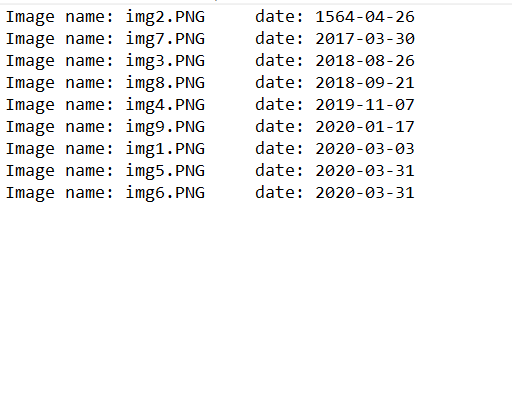

# Image File sorting

This project is to sort Image Files according to dates in the Imagess. tesseract is used to convert text in the image to string. Then dates are fetched from the string. finally result is saved in  **FileSorting/DateWiseSortedFileInfo.txt** file. one to put all the images in 
**FileSorting/images/** folder. then run main.py file. result will be saved like below image

also result will be shown in console

